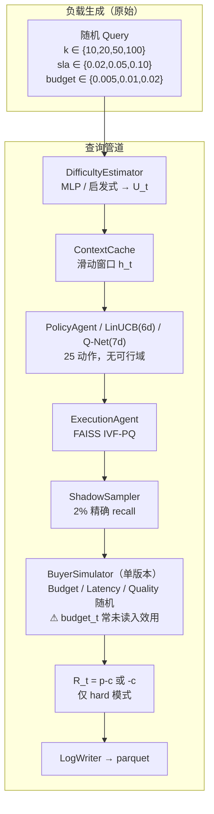
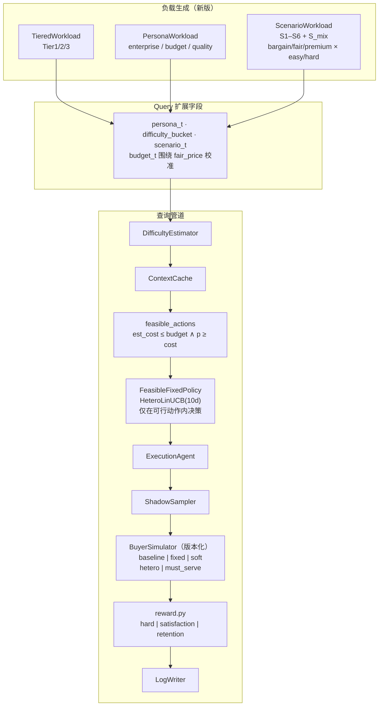
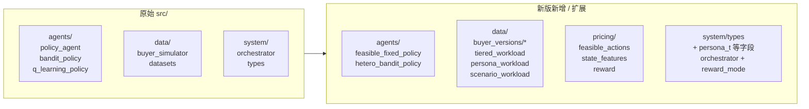
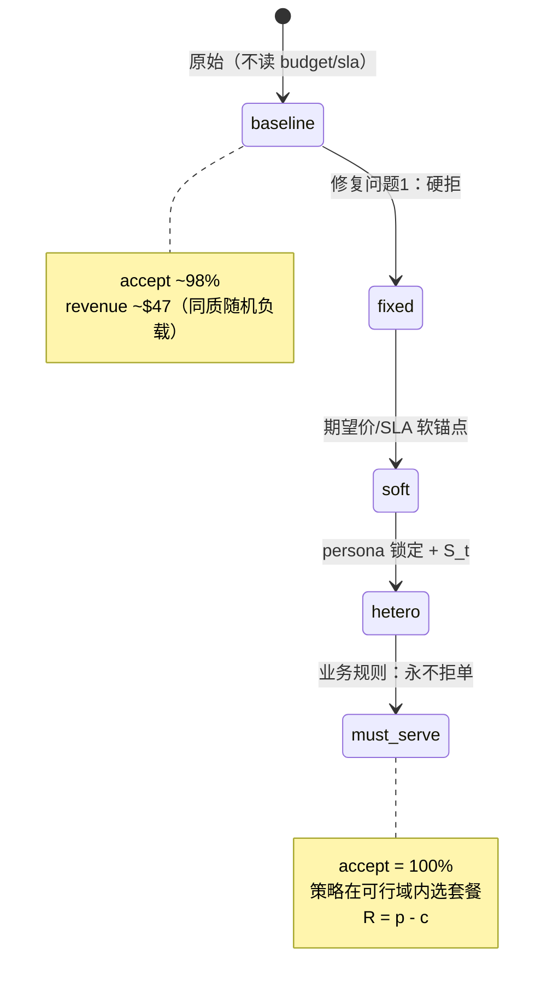
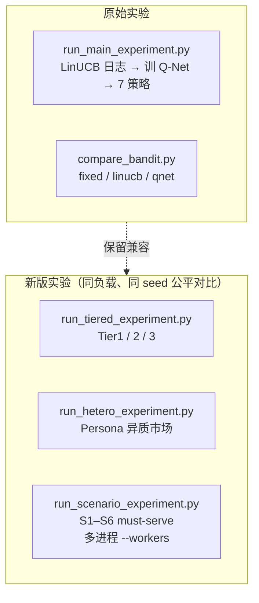
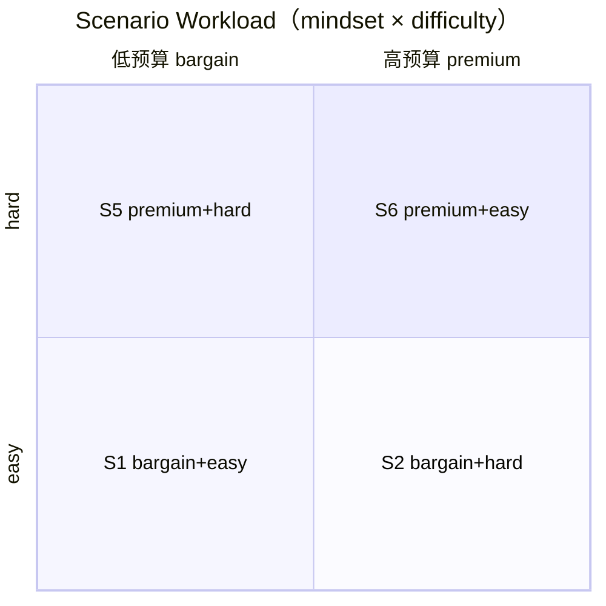

# ANN Marketplace — 原始架构 vs 新版架构对比

> 交付文档 · 2026-07-06  
> 代码包：`ann-marketplace-v2-delivery-*.tar.gz`

---

## 一、总览对比

| 维度 | 原始版本 | 新版（v2） |
|------|----------|------------|
| **业务规则** | 买方可拒单；`budget_t`/`sla_t` 常未参与决策 | 支持 **must-serve**（永不拒单）；可行域内必交付 |
| **负载生成** | `k/sla/budget` 独立随机抽取 | Tier / Persona / **Scenario S1–S6** 结构化负载 |
| **买家模型** | 单文件，三种类型随机轮换 | **5 个可切换版本**（baseline/fixed/soft/hetero/must_serve） |
| **策略状态** | LinUCB **6 维**；Q-Net **7 维** | HeteroLinUCB **10 维**（含 persona + 预估成本） |
| **动作选择** | 25 动作全集，无约束 | **可行域过滤**（`est_cost ≤ budget` 且 `p ≥ cost`） |
| **收益函数** | 仅 `hard`（拒单罚 `-c`） | `hard` / `satisfaction` / `satisfaction_retention` |
| **实验脚本** | `run_main_experiment` + `compare_bandit` | + tiered / hetero / **scenario** 分层对比 |
| **并行** | 串行 | scenario 实验支持 **多进程** `--workers` |

---

## 二、流水线架构对比

### 2.1 原始架构（v1）



**原始已知局限（文档第八节）：**
- `sla_t` / `budget_t` 与买家身份不关联 → 策略难以利用异质性
- Fixed `(nprobe=32, p=$0.005)` 在同质负载上极强
- Q-Net 均匀探索时易触发 hard_budget 拒单

---

### 2.2 新版架构（v2）



---

## 三、模块结构对比



### 新增文件清单

```
src/pricing/
├── feasible_actions.py      # 可行域：成本包络 + 不亏本
├── state_features.py        # 10 维异质状态
└── reward.py                # 三种奖励塑形

src/data/
├── buyer_versions/
│   ├── problem1_baseline.py # 原始 bug 保留（可复现）
│   ├── problem1_fixed.py    # 超价/超 SLA 硬拒
│   ├── problem1_soft.py     # 软约束
│   ├── hetero_soft.py       # persona 锁定 + 满意度
│   └── must_serve.py        # A_t 恒 True
├── tiered_workload.py
├── persona_workload.py
└── scenario_workload.py

src/agents/
├── feasible_fixed_policy.py
└── hetero_bandit_policy.py

scripts/
├── switch_buyer_version.py
├── run_tiered_experiment.py
├── run_hetero_experiment.py
└── run_scenario_experiment.py   # 支持 --workers 多进程

configs/
├── sift1m_hetero.yaml
└── sift1m_scenario.yaml
```

---

## 四、买家模型演进



切换方式：

```bash
python scripts/switch_buyer_version.py must_serve
# 或
BUYER_VERSION=must_serve python scripts/run_scenario_experiment.py ...
```

---

## 五、实验体系对比



### 关键实验结果（同负载对比，勿跨实验混比）

| 实验 | 负载 | Fixed | 动态策略 | 提升 |
|------|------|-------|----------|------|
| main_results（原始） | 随机 budget，baseline 买家 | ~$47.55 | — | — |
| sift1m_hetero_real | PersonaWorkload | $25.57 | HeteroLinUCB $28.51 | **+11.5%** |
| sift1m_scenario_must_serve | S1–S6，must-serve | ~$24.6 | HeteroLinUCB ~$36.6 | **+48~50%** |

> ⚠️ **$47 vs $25 不可直接比较**：买家版本、负载生成、奖励模式均不同。

---

## 六、状态空间对比

### LinUCB / Q-Net（原始）

```
[0] U_t×100
[1] accept_rate
[2] latency_ms
[3] k/100
[4] sla×1000
[5] budget×1000
[6] sentiment          ← 仅 Q-Net
```

### HeteroLinUCB（新版，10 维）

```
[0..5] 同上（LinUCB 基础特征）
[6] sentiment
[7] est_cost           ← 前置成本预估
[8] is_enterprise      ← persona one-hot
[9] is_budget
```

---

## 七、场景负载 S1–S6



| 场景 | mindset | 难度 | persona | 预算系数（× fair_price） |
|------|---------|------|---------|--------------------------|
| S1 | bargain | easy | budget | 0.35 – 0.55 |
| S2 | bargain | hard | budget | 0.35 – 0.55 |
| S3 | fair | easy | quality | 0.92 – 1.08 |
| S4 | fair | hard | quality | 0.92 – 1.08 |
| S5 | premium | hard | enterprise | 1.15 – 1.45 |
| S6 | premium | easy | enterprise | 1.15 – 1.45 |
| S_mix | 每条 query 随机 S1–S6 | — | — | — |

---

## 八、数据流（新版 must-serve 场景实验）

```
SIFT1M xq[i] 向量
    ↓ MLP 难度估计 U_t
ScenarioWorkloadBuilder.generate_sequence(S?, seed)
    ↓ 生成 5000 条 Query（含 persona_t, budget_t, sla_t, k_t）
Orchestrator.handle_query × 5000
    ↓ FeasibleFixedPolicy 或 HeteroLinUCB（可行域内）
    ↓ must_serve 买家：A_t=1, 输出 S_t
    ↓ reward_mode=hard → R = p - c
汇总 revenue / mean_satisfaction → CSV
```

并行：42 jobs = 7 场景 × 3 seeds × 2 策略，`--workers 42` 约 56 秒（88 CPU）。

---

## 九、尚未迁移到新版的部分

以下保持原始实现，**未删除、未破坏兼容**：

- `bandit_policy.py` / `q_learning_policy.py` / `naive_dqn_policy.py`
- `scripts/train_qnet.py` / `validate_dr.py` / `run_main_experiment.py`
- Q-Net 仍为 **7 维状态**，未在 10 维异质框架下重训
- `run_hetero_experiment.py` / `run_tiered_experiment.py` 暂未加多进程（仅 scenario 实验已支持）

---

## 十、推荐阅读顺序（给同事）

1. 本文 `docs/ARCHITECTURE_COMPARISON.md`
2. 根目录 `DELIVERY_README.md`（环境 + 快速复现）
3. `docs/买家模型已知问题.md`
4. `reports/sift1m_hetero_real.csv` / `reports/sift1m_scenario_must_serve.csv`
